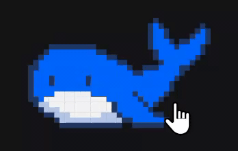
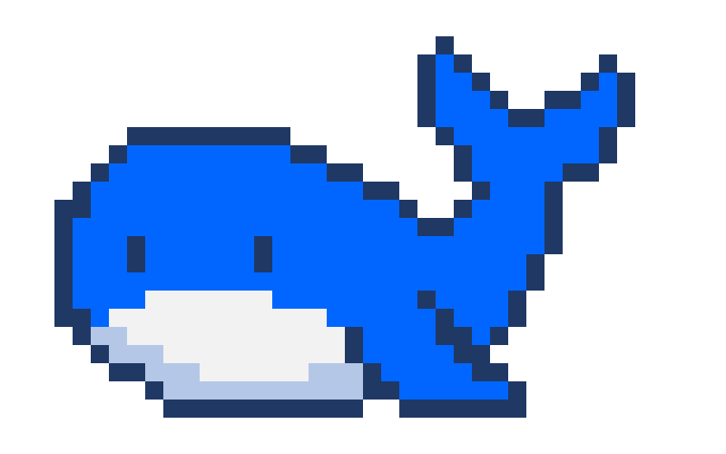
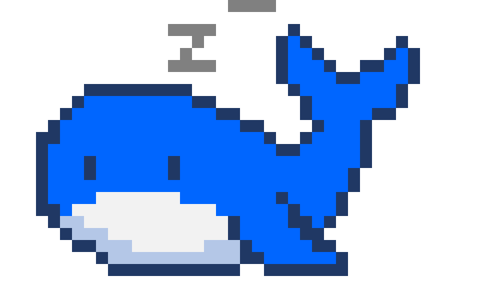

# 安装

[简体中文](./INSTALL.md) | **English**

> **Version selection**: `v0.3.3` (default, includes the sleep animation) targets DSH snapshot snapshot0810 (`snapshots/20260810T155924Z`) and is also compatible with snapshot0811 (`snapshots/20260811T152241Z`) and the final snapshot snapshot0812 (`snapshots/20260812T172954Z-final`); `v0.3.2` (includes the sleep animation) targets snapshot0806 (`snapshots/20260806T160212Z`); `v0.2.0` is likewise a 0806 build (no sleep animation); `v0.1.0` targets snapshot0805 (`snapshots/20260805T134133Z`) and is installed the old way. All the above builds are also compatible with snapshot0807 (`snapshots/20260807T130646Z`), snapshot0808 (`snapshots/20260808T121140Z`) and snapshot0809 (`snapshots/20260809T140917Z`) — users on 0807~0812 can install the default version directly. For the version mapping see [README.md](README.md#版本对应--version-compatibility).

> **npm release**: `v0.3.3` is compatible with the DSH npm release `@deepseek-ai/dsh@0.0.1-rc.5` (dist-tag `next`, i.e. the npm release of the final snapshot snapshot0812) and `@deepseek-ai/dsh@0.0.1-rc.2` (the npm release of snapshot0811); runtime, typecheck and boot manifest all verified in practice. Starting from 0811 the vendored cordis was renamed to `@deepseek-ai/cordis` — this plugin has migrated its type imports and peer dependency to `@deepseek-ai/cordis` (`^4.0.1-rc.1`, which is `4.0.1-rc.4` on the npm rc.5 baseline), and a plain `npm install` no longer reports ERESOLVE. Handled automatically by `dsh plugin`/pnpm installs.

Prerequisites: **a built DSH snapshot** (`~/.dsh/source/current` points to a snapshot containing `lib/` artifacts — the `link:` dev dependencies of `cordis` and each `@deepseek-ai/dsh-client-*` resolve from that snapshot) + `dsh web` running. This plugin is a **pure client-side plugin package** (the `dshClient` line; the Node half is empty), so installing = ① the package is resolvable by the config tree + ② one line added to the config.

## Current default install (dsh-v0.1.2-alpha.1, v0.3.5)

**Latest default install**: `v0.3.5` targets `dsh-v0.1.2-alpha.1` (GitHub tag, source-built install, not published to npm; it is also the latest version after `0.1.1-rc.1`).

```sh
# 1. Clone the repository; build artifacts are already in-tree (no build needed)
git clone https://github.com/lhh010/dsh-ui-whale.git
cd dsh-ui-whale && pnpm install

# 2. Install into the web profile
dsh plugin --profile web add link:/path/to/dsh-ui-whale
#   or a pinned-tag git dependency:
#   dsh plugin --profile web add '@dsh-external/dsh-ui-whale@github:lhh010/dsh-ui-whale#v0.3.5'
```

> Config line (`$DSH_HOME/profiles/web/cordis.patch.yml`, hot-reloaded, no restart needed):
> ```yaml
> - insert:
>     - id: dsh-ui-whale
>       name: '@dsh-external/dsh-ui-whale'
> ```

## Prompt install (let DSH install it)

Paste this prompt into any DSH session and the agent installs it for you:

> Install the dsh-ui-whale plugin (DSH session-header pixel whale pet):
> 1. Run `dsh plugin --profile web add '@dsh-external/dsh-ui-whale@github:lhh010/dsh-ui-whale#v0.3.6'` (the first run may fail because pnpm 11 blocks node-pty build scripts)
> 2. Under `~/.dsh/profiles/web`, run `pnpm approve-builds --all` (approve the build scripts)
> 3. Re-run the install command from step 1
> 4. Remind me to hard-refresh the browser (Ctrl/Cmd+Shift+R)
> On errors, first check the FAQ/known limitations in the README at https://github.com/lhh010/dsh-ui-whale

## Migration guide (DSH 0.1.1-rc.1 → 0.1.2-alpha.1)

0.1.2-alpha.1 is an author-facing alpha (not published to npm) with breaking Client API rework; the official `ChatSnapshot.legacy` compatibility projection keeps the old fields, and this plugin v0.3.5 has completed the migration:

- **The `@deepseek-ai/dsh-client-runtime` package was removed**: `ClientContext` now imports from `@deepseek-ai/cordis` (`import type { Context as ClientContext }`).
- **`ConversationSnapshot` was refactored into a views architecture**: the old `partial`/`runningCalls` moved to the `ChatSnapshot.legacy` compatibility projection; session lifecycle fields (`running` etc.) remain on the new `SessionSnapshot`.
- **Component props**: `PropsRuntime` is read through the `useSession` (lifecycle) + `useConversation` (ConversationSnapshot) double seats; cross-package slot registration now uses `ctx.slots.inject(name, () => ctx.slots.register(...))`.
- **Plugin-author migration steps**: ① replace `ClientContext`/type import paths; ② read streaming/tool state via `useConversation → views.get('chat')?.legacy`; ③ read session lifecycle via `useSession`; ④ register via `ctx.slots.inject`; ⑤ update `package.json` `dsh.client.inject` (drop `dsh-client-runtime`) and the `devDependencies` link.

## snapshot0810 (v0.3.3) — profile install method

```sh
# 1. 克隆仓库，构建产物已入库，无需构建
git clone https://github.com/lhh010/dsh-ui-whale.git
cd dsh-ui-whale && pnpm install

# 2. 装进 web profile（等价于在 $DSH_HOME/profiles/web 下执行 pnpm add）
dsh plugin --profile web add link:/path/to/dsh-ui-whale
#   或固定 tag 的 git 依赖：
#   dsh plugin --profile web add '@dsh-external/dsh-ui-whale@github:lhh010/dsh-ui-whale#v0.3.3'
```

## snapshot0806 (v0.3.2 / v0.3.1 / v0.3.0 / v0.2.0) — profile install method

```sh
# 1. 克隆仓库，构建产物已入库，无需构建
git clone https://github.com/lhh010/dsh-ui-whale.git
cd dsh-ui-whale && pnpm install

# 2. 装进 web profile（等价于在 $DSH_HOME/profiles/web 下执行 pnpm add）
dsh plugin --profile web add link:/path/to/dsh-ui-whale
#   或固定 tag 的 git 依赖：
#   dsh plugin --profile web add '@dsh-external/dsh-ui-whale@github:lhh010/dsh-ui-whale#v0.3.2'
```

Config lines (`$DSH_HOME/profiles/web/cordis.patch.yml`, hot-reload, no restart needed):

```yaml
- insert:
    - id: dsh-ui-whale
      name: '@dsh-external/dsh-ui-whale'
```

## snapshot0806 — registry install method (optional channel)

Prerequisites: DSH has plugin-registry integrated (the `dsh registry` command is available; that integration is an internal flow the public mirrors do not depend on — public installs use the profile method above).

```sh
# 目录安装（需要代码，克隆 + pnpm install 后）
dsh registry install /path/to/dsh-ui-whale
# 或 tarball 分发（接收方无需克隆）：
#   tar -czf dsh-ui-whale.tgz -C ./dsh-ui-whale .
#   dsh registry install dsh-ui-whale.tgz
dsh registry enable @dsh-external/dsh-ui-whale
```

## snapshot0805 (v0.1.0) — old install method

### Option 1: clone + link into the harness (recommended)

```sh
# 1. 克隆仓库，构建产物已入库，无需构建
git clone https://github.com/lhh010/dsh-ui-whale.git
cd dsh-ui-whale && pnpm install

# 2. 让包装进 harness 依赖链（在 DSH 快照根目录，~/.dsh/source/current 指向的那个）
pnpm add -w link:/path/to/dsh-ui-whale
```

> If your pnpm refuses `pnpm add -w` because of a store version mismatch, symlink manually instead:
> `mkdir -p node_modules/@dsh-external && ln -s /path/to/dsh-ui-whale node_modules/@dsh-external/dsh-ui-whale`

### Option 2: git dependency (pinned commit/tag, no implicit latest)

```sh
# 在 harness 根目录执行；<commit> 为发布 commit（0805 用 tag v0.1.0）
pnpm add '@dsh-external/dsh-ui-whale@github:lhh010/dsh-ui-whale#v0.1.0'
```

### Config lines (0805 legacy mechanism)

`~/.dsh/config.yaml` (create it if it doesn't exist):

```yaml
- insert:
    - id: dsh-ui-whale
      name: '@dsh-external/dsh-ui-whale'
```

## Restarting `dsh web`

Plugin set changes follow the "effective on restart" discipline (applicable under the 0805 legacy mechanism; the 0806 profile method hot-reloads config lines, no restart needed). Stop the current web (Ctrl+C) and start it again.

## Verification

The session title bar (right side of the title row) shows a pixel whale: when idle it blinks / occasionally wags its tail / moves its pectoral fins; while the model is thinking or tools are running, the tail wags continuously and the pectoral fins flutter; when a turn completes, water spray spouts from the top of its head (one-way 0-1-2-3-4-5-6); when you click the whale, a pink heart pops up in the upper-left corner, growing from small to large and then disappearing (one-way 0-1-2-3-0).

## Demo



Each action GIF:

  

  

> Full video: [docs/dsh-ui-whale-demo.mp4](docs/dsh-ui-whale-demo.mp4)
